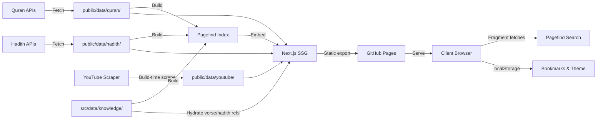
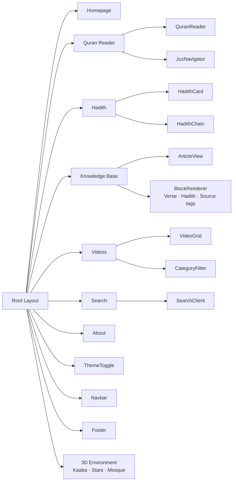
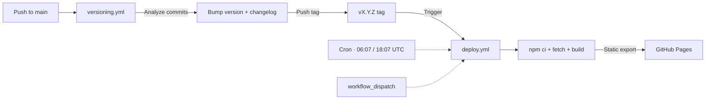

<div align="center">

# Noor — نور

**نُورٌ عَلَىٰ نُورٍ** — *Light upon light.*

A premium open-source Quran & Hadith platform — complete Quran with multilingual translations, seven authentic Hadith collections (36,000+ hadiths), a trilingual Knowledge Base, and a curated Islamic video library. Fully static, zero runtime cost.

[](https://github.com/mdsarfarazalam840/Islamic-website/actions)


[](https://github.com/anomalyco/quran-website/actions)

[](https://www.typescriptlang.org)
[](https://nextjs.org)
[](https://tailwindcss.com)
[](/LICENSE)

</div>

---

## Table of Contents

- [Features](#features)
- [Architecture](#architecture)
- [Tech Stack](#tech-stack)
- [Getting Started](#getting-started)
- [Project Structure](#project-structure)
- [CI/CD](#cicd)
- [Design System](#design-system)
- [Contributing](#contributing)

---

## Features

### 📖 Quran Reader
All 114 surahs with Arabic (Uthmani script) + English, Urdu, Hindi translations. Triptych layout: navigation sidebar | Arabic center panel | translation panel. Gold-illuminated ayah numbers, gold drop-caps, verse markers. Juz navigator with gold dot indicators. Ayah bookmarking, copy, and share.

### 📜 Hadith Collections
36,000+ authentic hadiths across 7 major collections — Bukhari, Muslim, Abu Dawud, Tirmidhi, Nasa'i, Ibn Majah, and Muwatta Malik. Sanad (narration chain) visualization. Grade badges: emerald (Sahih), gold (Hasan), muted (Da'if). Full-text search via Pagefind.

### 📚 Knowledge Base
A trilingual (English · हिन्दी · اردو) library of 63 source-graded articles across five categories — the Basics (pillars & articles of faith), Core Concepts, the 25 Prophets, Quranic Stories, and Surah Virtues. Per-article language toggle. `verse` blocks render **live** Arabic + translations pulled from the Quran data (no duplicated scripture); `hadith` blocks deep-link into the Hadith library. Every article carries graded source tags (Quran / hadith / tafsir / seerah) rendered as strength-colored badges. Indexed into Pagefind.

### 🎬 Scholar Videos
20+ renowned Islamic scholars linked to their YouTube channels. Long-form videos scraped at build time — no API keys, no quota, no billing. Category filtering: Tafsir, Seerah, Fiqh, Aqeedah, Dawah, and more.

### 🔍 Global Search
Unified search across Quran, Hadith, Knowledge Base, and Videos. Pagefind static index for Quran, Hadith & Knowledge Base — fetches only fragment chunks per query. Fuse.js for the video list.

### 🎨 Noor Al-Quds Design System
Chamber-based navigation — every page is a sacred chamber with unique lighting. Gold + deep navy palette. Vanishing navbar with floating lantern button. Three.js 3D environment (star particles, Kaaba model). Dark/Light modes.

### ⚡ Performance
100% SSG — every route pre-rendered at build time. Pagefind fragment-based search. 3D components lazy-loaded. GitHub Pages CDN + PWA offline via service worker.

---

## Architecture

### Data Flow



### Component Structure



### The Chamber Concept

Every page is a chamber in a sacred building, each with its own lighting and mood:

| Page | Chamber | Lighting | Mood |
|------|---------|----------|------|
| Homepage | Grand Foyer | Warm golden beam | Welcoming |
| Quran Reader | Scriptorium | Soft gold glow | Contemplative |
| Hadith | Chain Library | Ambient lantern | Scholarly |
| Knowledge Base | Study Hall | Steady gold | Teaching |
| Videos | Assembly Hall | Dynamic | Engaging |
| Search | Beacon | Focused beam | Precise |
| About | Cloister | Soft muted | Reflective |

---

## Tech Stack

| Layer | Technology |
|-------|-----------|
| Framework | Next.js 16 (App Router, `output: "export"`) |
| Language | TypeScript |
| UI | React 19 + shadcn/ui + @base-ui |
| Styling | Tailwind CSS v4 + tw-animate-css |
| 3D | Three.js + React Three Fiber + Drei |
| Animation | Framer Motion |
| Search | Pagefind (Quran + Hadith + Knowledge Base) · Fuse.js (videos) |
| Icons | Lucide React |
| State | Zustand + TanStack Query |
| Validation | Zod |
| Hosting | GitHub Pages · PWA |
| CI/CD | GitHub Actions |
| Fonts | Inter · Playfair Display · Noto Naskh Arabic |

---

## Getting Started

### Prerequisites
- Node.js 22+
- npm

### Install & Run

```bash
git clone https://github.com/mdsarfarazalam840/Islamic-website.git
cd Islamic-website
npm install
npm run dev
```

Open [http://localhost:3000](http://localhost:3000).

### Build Data

```bash
npm run fetch:quran        # Quran JSON
npm run fetch:hadith       # 7 Hadith collections
npm run fetch:youtube      # Latest videos
npm run build:pagefind     # Search index
npm run fetch:all          # All of the above
```

### Production Build

```bash
npm run build:static       # Pagefind + Next.js → out/
```

### Test

```bash
npm run dev                # Terminal 1
pip install playwright && playwright install chromium
python tests/phase1.py
python tests/phase3_hadith.py
python tests/phase4_video.py
python tests/phase5_search.py
python tests/phase6_polish.py
```

---

## Project Structure

```
src/
├── app/                    # Next.js App Router
│   ├── layout.tsx          # Root layout (fonts, nav, footer, providers)
│   ├── page.tsx            # Homepage (3D hero, quick links)
│   ├── globals.css         # Tailwind theme, custom utilities
│   ├── quran/              # Quran module
│   ├── hadith/             # Hadith module
│   ├── knowledge-base/     # Knowledge Base (category & article routes)
│   ├── videos/             # Video library
│   ├── search/             # Global search
│   └── about/              # About page
├── components/
│   ├── layout/             # Navbar, Footer, Sidebar, MobileNav
│   ├── quran/              # QuranReader, AyahDisplay, SurahCard, JuzNavigator
│   ├── hadith/             # HadithCard, HadithChain, CollectionCard, HadithSearch
│   ├── knowledge/          # ArticleView, BlockRenderer, VerseBlockView, HadithBlockView, SourceTagBadge
│   ├── videos/             # VideoCard, VideoGrid, YouTubeEmbed, CategoryFilter
│   ├── three/              # HeroScene3D, KaabaModel, MosqueScene, StarParticles
│   ├── ui/                 # shadcn primitives
│   └── shared/             # ThemeToggle, BookmarkButton, SearchBar, Breadcrumbs, ErrorBoundary
├── config/                 # site.ts, scholars.ts, api.ts
├── lib/                    # Data layers (quran, hadith, youtube, knowledge, utils)
├── hooks/                  # useBookmarks, useQuran, useYouTube
└── types/                  # TypeScript interfaces

public/
├── data/                   # Pre-built JSON (quran, hadith, youtube)
├── pagefind/               # Static search index
├── images/                 # Icons, scholar profiles
├── manifest.json           # PWA manifest
└── sw.js                   # Service worker

src/data/
└── knowledge/articles/     # Knowledge Base articles (one JSON per article)

scripts/
├── fetch-quran-data.ts     # Quran JSON builder
├── fetch-hadith-data.ts    # Hadith JSON builder
├── fetch-youtube-data.ts   # YouTube scraper
├── build-pagefind-index.mjs
└── bump-version.js         # Conventional-commit versioning
```

---

## CI/CD

Two GitHub Actions workflows drive releases. Tags are the **single source of truth** for what is live.



> [!TIP]
> **Break-glass rollback** — redeploy any known-good release:
> ```bash
> git tag -f v1.2.0 <good-commit-sha>
> git push -f origin v1.2.0
> ```
> The tag push triggers deploy and ships that exact commit.

---

## Design System

Full documentation in [`DESIGN.md`](./DESIGN.md).

### Color Palette

```
--space-deep:   #050a14    — Deepest background
--space-navy:   #0b1424    — Primary background
--gold-light:   #e8d48b    — Bright gold (CTAs, highlights)
--gold-main:    #d4af37    — Primary gold (accents, icons)
--gold-dim:     #b8922e    — Muted gold (borders, secondary)
--emerald:      #1a8a5c    — Success, completion
--text-primary: #e8e0d0    — Body text
```

Gold is never flat — all gold elements use multi-stop gradients for metallic foil reflectivity.

### Data Sources

| Data | Source | When |
|------|--------|------|
| Quran (Arabic + EN/UR/HI) | Public Quran APIs | Build → `public/data/quran/` |
| Hadith (7 collections) | Public Hadith APIs | Build → `public/data/hadith/` |
| Knowledge Base (EN/HI/UR) | Authored, source-graded articles | Hand-written → `src/data/knowledge/articles/` |
| Scholar Videos | YouTube `/videos` tabs | Build + twice-daily cron → `public/data/youtube/` |

YouTube runs on GitHub's US runners. Per-channel failures fall back to bundled mock data.

---

## Contributing

Use **Conventional Commits** (`feat:`, `fix:`, `chore:`, `BREAKING CHANGE:`).

1. Fork the repo
2. `git checkout -b feat/amazing-feature`
3. `git commit -m 'feat: add amazing feature'`
4. `git push origin feat/amazing-feature`
5. Open a Pull Request

---

<div align="center">

**Noor** — *Light.* May this project bring benefit and draw people closer to the Qur'an and Sunnah.

*"يَرْفَعِ ٱللَّهُ ٱلَّذِينَ ءَامَنُوا۟ مِنكُمْ وَٱلَّذِينَ أُوتُوا۟ ٱلْعِلْمَ دَرَجَـٰتٍۢ"*  
*Allah will raise those who have believed among you and those who were given knowledge, by degrees.*  
— Quran, Surah Al-Mujadila (58:11)

</div>
